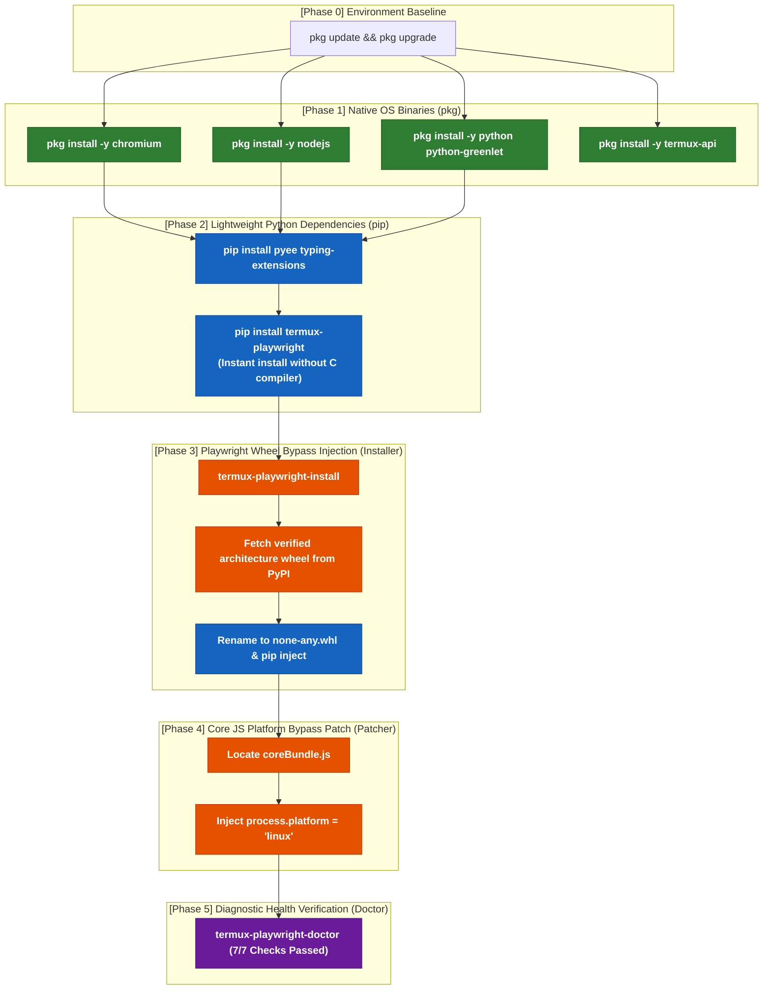

# 📱 Termux-Playwright

[](https://pypi.org/project/termux-playwright/)
[](https://www.npmjs.com/package/termux-playwright)
[](https://pepy.tech/projects/termux-playwright)
[](https://opencollective.com/ameva-fund)
[](https://github.com/sponsors/uno-km)
[](LICENSE)
[](https://www.python.org/)
[](https://nodejs.org/)
[-green.svg)](https://termux.dev/)
[](tests/)

> **Run genuine Chromium browser automation (Headless & full JavaScript SPA rendering) directly on Android devices inside Termux without PRoot or root privileges.**
> **Dual Engine Support: Native Python & Node.js / JavaScript.**

Transform any spare Android smartphone into a 24/7 autonomous web scraping and data harvesting node.

[📖 Korean Deep-Dive Engineering Documentation](docs/blog_post.md)

---

## ⚡ Quick Start (1-Click Installation)

### 🐍 Python:
```bash
pip install termux-playwright && termux-playwright-install
```

### ☕ Node.js / JavaScript:
```bash
npm install termux-playwright && npx termux-playwright install
```

### 🪄 Universal Shell Bootstrapper (Zero-Friction):
```bash
curl -sL https://raw.githubusercontent.com/uno-km/termux-playwright/main/install.sh | bash
```

> [!TIP]
> **💡 Pro-Tip for Flaky Network Mirrors:**
> If `pkg install` ever stalls or reports HTTP mirror errors on a fresh Termux install, simply switch to an optimal mirror by running `termux-change-repo` and `pkg update -y` manually before retrying.

> **🔥 What the automated installer provisions behind the scenes:**
> 1. Provisions native Termux packages (`x11-repo`, `chromium`, `nodejs`, `python-greenlet`, `procps`, `termux-api`) with zero 1.2GB Clang build bloat.
> 2. Downloads and injects the official architecture-specific Playwright wheel as platform-agnostic `none-any.whl`.
> 3. Atomically applies the `coreBundle.js` platform verification bypass patch.
> 4. Runs a comprehensive 7-phase `termux-playwright-doctor` diagnostic health check.

---

## 🏗️ 1. Complete Dependency Architecture Matrix (`pkg` vs `pip` vs `Patch`)

| Layer | Package / Component | Provider | Type | Prerequisite | Key Responsibility |
| :--- | :--- | :---: | :---: | :--- | :--- |
| **0. Language Runtime** | `python` (3.8+) | **`pkg`** | C Binary | Termux Base | Python script and crawler execution engine |
| **1. Native Browser** | `chromium` | **`pkg`** | C++ Binary | Termux X11/GUI | Real native Chromium browser controlled via CDP |
| **2. Driver RPC Server** | `nodejs` | **`pkg`** | C++ Binary | Android Bionic | Node.js RPC bridge connecting Python and Chromium |
| **3. Async C-Extension** | `python-greenlet` | **`pkg`** | C Binary | `python` | Precompiled async coroutine loop (avoids 1.2GB Clang compile) |
| **4. Power Management** | `termux-api` | **`pkg`** | C Binary | Android API | Prevents CPU sleep when screen is off (`termux-wake-lock`) |
| **5. Pure Python (A)** | `typing-extensions` | **`pip`** | Pure Python | `python` | Backported type hinting compatibility across Python versions |
| **6. Pure Python (B)** | `pyee` | **`pip`** | Pure Python | `python` | High-performance event emitter for browser events |
| **7. Runtime Optimizer** | `termux-playwright` | **`pip`** | Pure Python | `pyee`, `typing-ext` | Android runtime tuning, installer, and session zombie reaper |
| **8. Upstream Core Wheel**| `playwright` (aarch64/x86_64) | **`pip (bypass)`** | Wheel Packaging | `python-greenlet` | Official PyPI wheel injected via `none-any` platform bypass |
| **9. Core JS Engine Patch** | `coreBundle.js` Patch | **Internal** | JS Byte Injection | `playwright` | Spoofs `process.platform = 'linux'` in driver RPC bundle |

---

## 🔄 2. Installation Lifecycle Flowchart



---

## ⚡ 3. Fail-Safe 5-Step Manual Installation Guide

### 🟢 Step 1: Native System Package Provisioning (`pkg`)
Install pre-compiled native binaries to avoid triggering heavy in-place compilation:
```bash
pkg update -y
pkg install -y x11-repo chromium nodejs python python-greenlet procps termux-api
```

### 🔵 Step 2: Python Tooling & Pure Packages (`pip`)
Install pure-Python dependencies cleanly:
```bash
pip install --upgrade pip setuptools
pip install pyee typing-extensions termux-playwright
```

> [!NOTE]
> **Virtual Environment Best Practice:** If you use a virtual environment, always create it with `--system-site-packages` to allow access to the native `python-greenlet` binary:
> ```bash
> python -m venv --system-site-packages venv
> source venv/bin/activate
> ```

### 🟠 Step 3~4: Automated Wheel Bypass & Core JS Patching
Download the architecture wheel, apply the platform verification bypass, and patch `coreBundle.js`:
```bash
termux-playwright-install
```

### 🟣 Step 5: Diagnostic Verification (`doctor`)
Verify system readiness across all 7 health indicators:
```bash
termux-playwright-doctor
```

> [!TIP]
> **💡 Key Engineering Design Principles:**
> 1. **Greenlet Ownership Isolation:** Pre-compiled `python-greenlet` MUST be installed via `pkg` to prevent `pip` from invoking `clang` compilation failure on Android Bionic.
> 2. **Slim `setup.py` Metadata:** `termux-playwright` specifies pure-Python dependencies to enable instant 1-second installation on mobile devices.
> 3. **Deterministic Order:** `pkg` $\rightarrow$ `pip` $\rightarrow$ `installer (wheel + patch)` $\rightarrow$ `doctor` maintains a 100% fail-safe deployment.

---

## 💡 Mobile Engineering Pro-Tips (pip, npm, venv, & Virtualization)

### 🐍 1. Python Virtual Environments (`venv`) & Pip Optimization
* **The `--system-site-packages` Rule:** Never run bare `python -m venv .venv` on Termux. Standard venvs isolate C-extensions, forcing pip to attempt building `greenlet` from source using 1.2GB Clang. Always pass `--system-site-packages`:
  ```bash
  python -m venv --system-site-packages .venv
  source .venv/bin/activate
  ```
* **Pip Cache Acceleration:** To conserve mobile internal storage (eMMC), disable temporary wheel caching during fast script installs:
  ```bash
  pip install --no-cache-dir termux-playwright
  ```
* **Poetry / Pipenv Configuration:** If using modern dependency managers in Termux, tell them to inherit system packages:
  ```toml
  # pyproject.toml / poetry config
  [virtualenvs]
  system-site-packages = true
  ```

---

### ☕ 2. Node.js & npm Storage & Speed Optimization
* **Flash Wear Reduction & Speed:** In Termux, `node_modules` can create thousands of small inodes that slow down mobile storage. Speed up installs with:
  ```bash
  npm install --no-fund --no-audit --prefer-offline
  ```
* **pnpm Hardlink Deduplication (Saves ~70% Storage):** Use `pnpm` to share package binaries across projects without duplicating files on mobile flash storage:
  ```bash
  pkg install -y pnpm
  pnpm add termux-playwright
  ```
* **V8 Heap Constraint on Mobile:** Default Node.js allocates up to 1.4GB heap. On 2GB~4GB RAM phones, always limit V8 heap size to prevent Android Low Memory Killer (LMK) execution:
  ```bash
  node --max-old-space-size=256 app.js
  ```

---

### 🛡️ 3. Native Bionic vs PRoot / Virtualization (Why Native Wins)
* **Zero Virtualization Overhead:** Do **NOT** install `proot-distro` (Ubuntu/Debian) just to run Playwright. PRoot intercepts every system call via `ptrace`, causing 3x~5x CPU latency, 60% higher RAM consumption, and broken `/dev/shm` shared memory.
* **Native Speed:** `termux-playwright` orchestrates Termux's native Android Bionic-compiled Chromium and Node.js directly, delivering full ARM64 hardware performance with zero root required.

---

### 🔋 4. 24/7 Autonomous Background Scraping (Daemon Guide)
Android aggressively suspends background apps and kills child processes when the screen turns off.

#### ☕ Node.js Production Daemon with PM2:
```bash
# Install PM2 process manager
npm install -g pm2

# Launch scraper with 256MB memory cap and automatic crash recovery
pm2 start app.js --name "mobile-scraper" --node-args="--max-old-space-size=256 --expose-gc"

# Keep alive on reboot / background
pm2 save
pm2 monit
```

#### 🐍 Python Production Daemon with Tmux & WakeLock:
```bash
# Keep CPU awake and detach terminal session
termux-wake-lock
pkg install -y tmux
tmux new -s scraper 'python crawler.py'
# Detach with: Ctrl+B, then D
# Re-attach anytime with: tmux attach -t scraper
```

---

### ⚡ 5. Android 14+ Phantom Process Killer Bypass
Android 12~14 limits background child processes to 32. Heavy browsers spawn multiple renderer and utility processes.
* **In-App Single-Process Mode:** Enable `single_process=True` (Python) or `singleProcess: true` (Node.js) to collapse Chromium into a single lightweight process that stays permanently under the Android 32-process limit.
* **ADB Command (Optional Permanent Bypass):**
  ```bash
  adb shell "/system/bin/device_config put activity_manager max_phantom_processes 2147483647"
  ```

---

## 🚀 Usage Examples

### Python Asynchronous API (`examples/basic_crawler.py`)
```python
import asyncio
from termux_playwright import async_playwright_termux, launch

async def main():
    # async_playwright_termux configures memory caps and ensures child process cleanup
    async with async_playwright_termux() as p:
        # Automatically detects Termux binaries, injects eMMC zero-wear flags and --no-sandbox
        browser = await launch(p, headless=True)
        page = await browser.new_page()
        
        await page.goto("https://news.ycombinator.com", timeout=60000)
        print(f"Page Title: {await page.title()}")
        
        await browser.close()

if __name__ == "__main__":
    asyncio.run(main())
```

### ☕ Node.js / JavaScript API (`examples/crawler.js`)
```javascript
const { launch, setupStealthContext, blockHeavyResources } = require('termux-playwright');

async function main() {
    // Automatically provisions session ledger, eMMC RAM cache, and WakeLock
    const browser = await launch({
        headless: true,
        stealth: true,
        lowMemoryMode: true,
        wakeLock: true
    });

    try {
        const context = await setupStealthContext(browser, {
            locale: 'en-US',
            timezoneId: 'America/New_York'
        });
        const page = await context.newPage();
        
        // Abort images and media to save mobile data & CPU
        await blockHeavyResources(page, { images: true, media: true, fonts: true });

        await page.goto('https://news.ycombinator.com', { timeout: 45000, waitUntil: 'domcontentloaded' });
        console.log('Page Title:', await page.title());
    } finally {
        await browser.close();
    }
}

main().catch(console.error);
```

### 🔋 24/7 Unattended Crawling with WakeLock & Context Recycling (`examples/advanced_crawler.py`)
```python
import asyncio
from termux_playwright import async_playwright_termux, launch, TermuxWakeLock

async def run_247_crawler():
    # Acquire Termux WakeLock to prevent Android CPU sleep when phone screen is off
    with TermuxWakeLock(fail_silently=True):
        async with async_playwright_termux() as p:
            browser = await launch(
                p,
                headless=True,
                low_memory_mode=False,  # Set True for <= 2GB RAM devices
                jitless=True,           # Adhere to Android 10+ W^X SELinux policy
            )
            
            # Best Practice: Periodically recycle contexts to clear Node.js RPC buffers
            context = await browser.new_context()
            page = await context.new_page()
            
            await page.goto("https://github.com", timeout=45000)
            print("Fetched:", await page.title())
            
            await context.close()
            await browser.close()

if __name__ == "__main__":
    asyncio.run(run_247_crawler())
```

### 🎛️ Customizing Chromium Arguments (`args=[...]`)
You can pass custom browser arguments directly to `launch()`. Key-value options (e.g. `--window-size`, `--disk-cache-dir`) automatically override default parameters cleanly:

```python
browser = await launch(
    p,
    headless=True,
    args=[
        "--window-size=1920,1080",               # Custom viewport resolution
        "--disk-cache-dir=/tmp/my_browser_cache", # Custom cache directory
        "--media-cache-size=20",                  # Media cache size in MB
        "--user-agent=MyCustomBot/1.0",           # Custom HTTP User-Agent
    ]
)
```

### 🥷 Stealth Mode & Anti-Bot Evasion (`setup_stealth_context`)
Bypass Cloudflare, DataDome, CreepJS, and advanced fingerprinting engines with prototype-safe navigator masking, Sub-pixel Canvas 2D LSB noise injection, AudioContext micro-frequency deviation, and WebGL driver spoofing:

```python
import asyncio
from termux_playwright import (
    async_playwright_termux,
    launch,
    setup_stealth_context,
    HumanMouse,
    HumanKeyboard,
    CellularIpRotator,
    TurnstileEvaluator,
)

async def main():
    async with async_playwright_termux() as p:
        browser = await launch(p, headless=True, stealth=True, single_process=True)
        
        # Configure stealth context with granular noise and fingerprint toggles
        context = await setup_stealth_context(
            browser,
            user_agent="Mozilla/5.0 (Linux; Android 10; K) AppleWebKit/537.36 (KHTML, like Gecko) Chrome/128.0.0.0 Mobile Safari/537.36",
            enable_canvas_noise=True,    # 1-bit LSB micro-noise on 10x10 top-left pixels
            enable_audio_noise=True,     # Micro frequency variance in AudioBuffer
            enable_webgl_mask=True,      # UNMASKED_VENDOR/RENDERER spoofing
            enable_webdriver_mask=True,  # Prototype-safe navigator.webdriver deletion
            extra_headers={"Accept-Language": "en-US,en;q=0.9"},
        )
        
        page = await context.new_page()
        await page.goto("https://bot.sannysoft.com", timeout=60000)
        print("Page Title:", await page.title())

        # Human interaction: Non-linear Bézier trajectory & Gaussian typing
        mouse = HumanMouse(page)
        await mouse.click((200, 300), steps=30, jitter=True, overshoot=True)
        await HumanKeyboard.type_text(page, "Automated data verification", selector="input[type='text']")

        # Solve Cloudflare Turnstile if present
        if await TurnstileEvaluator.detect_challenge(page):
            await TurnstileEvaluator.solve_turnstile(page, human_mouse=mouse)

        await browser.close()

if __name__ == "__main__":
    asyncio.run(main())
```

#### 🎛️ Next-Gen Feature Toggle & Parameter Matrix

| Module | Class / Function | Config Parameter | Type / Default | Description |
| :--- | :--- | :--- | :---: | :--- |
| **`stealth`** | `setup_stealth_context` | `enable_canvas_noise` | `bool = True` | Injects 1-bit LSB noise into Canvas 2D to randomize canvas fingerprint hashes without visual distortion. |
| **`stealth`** | `setup_stealth_context` | `enable_audio_noise` | `bool = True` | Injects \((Math.random() - 0.5) \cdot 10^{-7}\) noise into `AudioBuffer` and `AnalyserNode`. |
| **`stealth`** | `setup_stealth_context` | `enable_webgl_mask` | `bool = True` | Spoofs WebGL unmasked vendor and renderer to standard ANGLE/Intel. |
| **`stealth`** | `setup_stealth_context` | `canvas_noise_seed` | `int? = None` | Optional seed for deterministic Canvas noise testing. |
| **`physics`** | `HumanMouse.click` | `jitter`, `overshoot` | `bool = True` | Simulates human hand muscle tremor (sub-pixel jitter) and target overshooting/correction. |
| **`physics`** | `HumanKeyboard.type_text` | `mean_delay`, `std_dev`| `0.12s, 0.035s`| Generates Gaussian-distributed typing intervals between keystrokes. |
| **`mobile`** | `CellularIpRotator` | `mode` | `'auto'` | Selects `termux_native` (device-internal) or `pc_adb_bridge` (PC USB/Wi-Fi ADB tethering). |
| **`mobile`** | `CellularIpRotator` | `verify_ip_change` | `bool = True` | Polls multiple public IP endpoints to guarantee a fresh residential IP after toggle. |
| **`waf`** | `TurnstileEvaluator` | `solve_turnstile` | `timeout=12.0s`| Detects Turnstile iframe and clicks verification checkbox with natural Bézier mouse physics. |

---

### 📱 Dual-Mode Cellular IP Rotator (`termux_playwright.mobile`)
Rotate your mobile carrier (LTE/5G) residential IP within 2~3 seconds via Android airplane mode toggling:

```python
import asyncio
from termux_playwright import CellularIpRotator, RotationMode

async def rotate_ip_demo():
    # Auto-detects whether running inside Termux or on PC via ADB bridge
    rotator = CellularIpRotator(mode=RotationMode.AUTO)
    
    current_ip = await rotator.get_public_ip()
    print(f"Current Public IP: {current_ip}")
    
    result = await rotator.rotate_ip(verify_ip_change=True)
    print(f"Rotation Result: Success={result['success']}, New IP={result['new_ip']}, Time={result['elapsed_seconds']}s")

asyncio.run(rotate_ip_demo())
```

---

### ☕ Node.js / TypeScript Next-Gen API:
```javascript
const {
    launch,
    setupStealthContext,
    HumanMouse,
    HumanKeyboard,
    CellularIpRotator,
    TurnstileEvaluator
} = require('termux-playwright');

async function main() {
    const browser = await launch(null, { headless: true, stealth: true });
    const context = await setupStealthContext(browser, {
        enableCanvasNoise: true,
        enableAudioNoise: true,
        enableWebglMask: true
    });
    const page = await context.newPage();
    await page.goto('https://bot.sannysoft.com');

    const mouse = new HumanMouse(page);
    await mouse.click([200, 300], { steps: 25, jitter: true });
    await HumanKeyboard.typeText(page, 'Search query', { selector: 'input[name="q"]' });

    await browser.close();
}
main();
```

---

## 🏰 Standalone Fortress Mode vs. Cooperative Multi-Tasking Mode

`termux-playwright` provides two distinct execution profiles designed for different concurrency and isolation requirements:

```python
# 🤝 1. Default Mode: Cooperative Multi-Tasking
# Non-blocking async event loop delegation; ideal for concurrent crawlers, bots, and background daemons.
browser = await launch(p, headless=True)

# 🏰 2. Standalone Fortress Mode
# 100% clean-room ephemeral profile, anti-throttling flags, max CPU priority, auto-wakelock, auto-purged on exit.
browser = await launch(p, headless=True, standalone_mode=True, wake_lock=True)
```

### ⚖️ Execution Modes & Trade-Off Matrix

| Feature / Dimension | 🤝 Cooperative Multi-Tasking (Default) | 🏰 Standalone Fortress (`standalone_mode=True`) |
| :--- | :--- | :--- |
| **Philosophy & Intent** | Cooperative multitasking alongside bots & daemons | Exclusive solo stage with 100% zero interference |
| **Profile Isolation** | Standard shared profile directory | **100% Isolated Ephemeral Profile (`/tmp/tp_solo_UUID`)** created on launch & completely purged on exit |
| **Event Loop Cleanups** | Non-blocking async worker thread (`asyncio.to_thread`) | Non-blocking async worker thread + Instant profile wipe |
| **CPU & Timer Priority** | Standard OS/Chromium power-saving scheduling | **Anti-Throttling Enabled** (`--disable-background-timer-throttling`, `--disable-renderer-backgrounding`) |
| **WakeLock Integration** | Manual `with TermuxWakeLock():` context | **Seamlessly coupled to browser lifecycle via `wake_lock=True`** |
| **Disk/Storage Impact** | Zero additional disk churn | Ephemeral profile in `/tmp` (Wiped 100% on close) |
| **Best Used For** | 24/7 background scrapers, parallel tabs, Telegram bots | **High-priority solo crawling, banking/auth sessions, benchmarks** |

---

## 🩹 Runtime Self-Healing Engine

If Playwright is updated in the future (e.g. `pip install --upgrade playwright`), the upstream package overwrites `coreBundle.js` with its unpatched version. 

`termux-playwright` detects this automatically in 0.001s upon `launch()` / `launch_sync()` and **auto-applies the platform patch on the fly**, guaranteeing 100% zero-friction operation without throwing cryptic `Unsupported platform: android` errors.

---

## 📁 Repository Structure

```
termux-playwright/
├── docs/                     # Technical documentation & audit reports
│   ├── blog_post.md          # Complete Korean engineering writeup
│   ├── INDEPENDENT_AUDIT_REPORT.md  # Comprehensive security audit report
│   └── PHANTOM_PROCESS_KILLER_GUIDE.md  # Step-by-step Phantom Killer ADB guide
├── examples/                 # Ready-to-run crawling demos
│   ├── basic_crawler.py      # Basic asynchronous scraping demo
│   └── advanced_crawler.py   # 24/7 unattended crawler with WakeLock
├── lib/                      # Node.js / JavaScript Dual Engine
│   ├── index.js              # Node.js public exports
│   ├── index.d.ts            # Full TypeScript definitions
│   ├── browser.js            # Node Chromium launcher
│   ├── stealth.js            # Canvas 2D LSB & Audio noise engine
│   ├── physics.js            # Cubic Bézier & Gaussian typing
│   ├── mobile.js             # Dual-Mode Cellular IP rotator
│   ├── waf.js                # Cloudflare Turnstile auto-solver
│   ├── reaper.js             # Node process reaper & WakeLock
│   └── platform.js           # Node platform & storage checks
├── termux_playwright/        # Python Dual Engine package
│   ├── __init__.py
│   ├── browser.py            # Android-hardened browser launcher & V8 args
│   ├── stealth.py            # Canvas 2D LSB & Audio noise engine
│   ├── physics.py            # Cubic Bézier & Gaussian typing
│   ├── mobile.py             # Dual-Mode Cellular IP rotator
│   ├── waf.py                # Cloudflare Turnstile auto-solver
│   ├── exceptions.py         # Typed exception hierarchy
│   ├── installer.py          # PyPI wheel bypass and dependency engine
│   ├── patcher.py            # Atomic JS coreBundle platform patcher
│   ├── platform.py           # Architecture and storage inspection
│   └── reaper.py             # Session-scoped process reaper & WakeLock
├── tests/                    # Python pytest test suite (100 tests)
│   ├── test_browser.py
│   ├── test_installer.py
│   ├── test_nextgen_mobile.py
│   ├── test_nextgen_physics.py
│   ├── test_nextgen_stealth.py
│   ├── test_nextgen_waf.py
│   ├── test_patcher.py
│   ├── test_platform.py
│   └── test_reaper.py
├── tests_js/                 # Node.js test suite (26 tests)
│   ├── test_core.test.js
│   ├── test_nextgen_mobile.test.js
│   ├── test_nextgen_physics.test.js
│   ├── test_nextgen_stealth.test.js
│   └── test_nextgen_waf.test.js
├── CHANGELOG.md              # Version release history
├── LICENSE                   # MIT License
├── package.json              # npm package definition
├── pyproject.toml            # Build configuration
├── README.md                 # Project documentation
└── setup.py                  # Setuptools distribution definition
```

---

## 🛡️ Reliability & Security Architecture

1. **Session-Scoped Process Reaper**: Injects `--termux-session-id={uuid}` to deterministically reap orphaned Chromium processes without collateral damage to other browser instances.
2. **Flash Memory (eMMC) Protection**: Injects `--disk-cache-dir=/dev/null` and `--disable-application-cache` to eliminate flash wear during intensive 24/7 crawling.
3. **Android 10+ W^X Policy Compliance**: Automatically injects `--js-flags=--jitless` on Android 10+ (SDK $\ge 29$) to adhere to SELinux executable memory policies.
4. **Thread-Safe Concurrency**: All process tracking collections are guarded by `threading.RLock()` with snapshot-and-clear concurrency.

---

## ⚙️ Resource Limits, Memory Tuning & Troubleshooting

Smartphone hardware differs significantly from servers: low-power CPUs, constrained RAM (1GB~4GB), and aggressive OS Doze/LMK (Low Memory Killer) daemons. Here is how to tune resources and prevent crashes:

### 1. 💾 Storage Exhaustion (`StorageExhaustionError`, Baseline: 150MB~300MB)
* **Root Cause:** Chromium creates temporary browser profiles under `/data/data/com.termux/files/usr/tmp`. Loading modern Single-Page Applications (SPAs) generates IndexedDB databases, font caches, and DOM snapshots. When free space is exhausted, the Android kernel locks I/O with `ENOSPC`, crashing Chromium.
* **Resolution & Tuning:**
  ```bash
  # 1. Clean package and temp caches (Recommended)
  pkg clean && rm -rf $TMPDIR/*
  
  # 2. Adjust threshold via environment variable (Default: Browser 150MB, Installer 300MB)
  export TERMUX_PLAYWRIGHT_MIN_STORAGE_MB=100
  ```

---

### 2. ⚡ V8 JavaScript Heap OOM (`Page crashed!`, Default: 256MB / Low-Memory: 128MB)
* **Root Cause:** Visiting complex SPA sites with `low_memory_mode=True` (128MB cap) can trigger `FatalProcessOutOfMemory` when DOM trees or JS bundles exceed the heap ceiling, causing SIGABRT renderer termination.
* **Resolution & Tuning:**
  * **Low-end devices ($\le$ 2GB RAM):** Keep `low_memory_mode=True` and block unnecessary assets (images, fonts).
  * **Standard devices ($\ge$ 3GB RAM):** Keep default `low_memory_mode=False` (allocates 256MB V8 heap).
  * **Customize V8 Heap via Environment Variable:**
    ```bash
    export TERMUX_PLAYWRIGHT_V8_MEMORY_MB=512
    ```

---

### 3. 🖥️ Node.js RPC Buffer Accumulation (`Connection closed`, Default: 512MB)
* **Root Cause:** Running an uninterrupted browser instance for days across thousands of pages causes Chrome DevTools Protocol (CDP) message queues and event listeners to accumulate in Node.js heap.
* **Best Practice (Cyclic Context Recycling):**
  ```python
  # Recycle context every 100~200 pages to completely purge Node.js RPC buffers
  for batch in chunked(urls, 100):
      context = await browser.new_context()
      page = await context.new_page()
      for url in batch:
          await page.goto(url)
      await context.close()  # Flushes all RPC buffers and temporary heap
  ```
  * Expand Node.js Memory Cap:
    ```bash
    export TERMUX_PLAYWRIGHT_NODE_MEMORY_MB=768
    ```

---

### 4. ⚡ JavaScript JIT Execution vs Android 10+ W^X Security Policy (`--jitless`)

Chromium's V8 JavaScript engine has two execution tiers:
1. **Ignition (Bytecode Interpreter):** Interprets JS bytecode sequentially without JIT compilation. Safe, low memory, but slower.
2. **TurboFan & Maglev (JIT Compiler):** Dynamically compiles JavaScript directly into ARM64 native machine code in RAM for 5x~20x faster execution.

#### 🛡️ Play Store Chrome vs Termux Chromium (`mmap(RWX)` & W^X Policy):
* **Official Google Chrome App:** A signed APK with OS entitlements utilizing system WebView/V8 memory channels.
* **Termux Chromium:** Runs as an unprivileged user-space Linux process inside the Termux sandbox. When Chromium's V8 JIT compiler attempts `mmap(..., PROT_READ | PROT_WRITE | PROT_EXEC)` to allocate dynamic executable machine code in RAM, Android 10+'s SELinux kernel blocks it as a security violation and **instantly terminates Chromium with `SIGSEGV` / `SELinux violation` (Exit 139)**.
* Therefore, on standard non-root Android 10+ devices, **`--jitless` is an essential survival shield** that forces Chromium to run on the Ignition interpreter, preventing instant crashes.

#### ⚖️ The Fundamental Trade-off Matrix:
| Execution Mode | How to Enable in Code | JavaScript Speed | Stability on Android 10+ | Recommendation |
| :--- | :--- | :--- | :--- | :--- |
| **Interpreter (`--jitless`)** | `launch(p)` or `jitless=True` | Standard (Slower for heavy JS) | 💎 **100% Rock-Solid (Zero Crashes)** | **Default & Recommended for 24/7 Scraping** |
| **Full V8 JIT (TurboFan)** | `launch(p, jitless=False)` | ⚡ 5x~20x Faster | 💥 Instant Crash on unrooted Android 10+ | Android 9 or Rooted devices ONLY |

#### 📱 Automatic Version Adaptation:
* **Android 9 or Older (e.g. Android 8.0/8.1 Oreo):** Does NOT have the W^X restriction. Our launcher **automatically leaves JIT enabled** for full-speed execution.
* **Android 10+ (API $\ge 29$):** Automatically injects `--js-flags=--jitless`.
* **Explicit Parameter Control:**
  ```python
  # Auto-detected by default (jitless=None)
  browser = await launch(p, jitless=True)   # Force interpreter mode (Rock-solid stability)
  browser = await launch(p, jitless=False)  # Force full JIT (Requires Android 9 or rooted device)
  ```

#### 🚀 How to Speed Up Heavy SPA Crawling under `--jitless`:
Because complex Single-Page Applications (SPAs like Naver, YouTube, Twitter) execute megabytes of JS, running without JIT on low-power mobile CPUs can take 20~40 seconds to complete full rendering. Use our built-in 1-line accelerator and best practices:

```python
from termux_playwright import async_playwright_termux, launch, block_heavy_resources

async with async_playwright_termux() as p:
    browser = await launch(p, headless=True)
    page = await browser.new_page()
    
    # ⚡ 1-Line Built-in Accelerator: Block heavy images/fonts/media (3x~5x speed boost)
    await block_heavy_resources(page)
    
    # 🚀 Best Practice: Extract data immediately once DOM is ready (60s timeout)
    await page.goto("https://www.naver.com", timeout=60000, wait_until="domcontentloaded")
```

> [!WARNING]
> **⚠️ Unlocking Full JIT on Android 10+:**
> Running full V8 JIT without `--jitless` requires either an Android 9 or older device, or a rooted device with permissive SELinux (`setenforce 0`). **Rooting or disabling SELinux is strictly NOT recommended** due to severe device security and integrity risks.

---

## 🔋 24/7 Unattended Background Operation & Android Deep Sleep Prevention

When your smartphone screen is turned off or left idle, Android OS aggressively triggers **Doze Mode** and puts the CPU into **Deep Sleep**, which suspends all background scripts and network connections.

To keep your Termux crawlers running continuously 24/7, use the following battle-tested setup:

### Method 1: Termux CLI Commands (Recommended & Fail-Safe)
Acquire the CPU wake lock directly in your terminal before launching long-running crawling tasks:

```bash
# 1. Prevent Android CPU from entering Deep Sleep
termux-wake-lock

# 2. Run your crawler in the background (using tmux, nohup, or background job)
nohup python examples/advanced_crawler.py > crawler.log 2>&1 &

# 3. Release the lock when you are finished
termux-wake-unlock
```

### Method 2: Android OS Battery Optimization & Phantom Process Killer Exemption
For uninterrupted multi-day execution, configure your smartphone OS settings:

1. **Android App Battery Settings:**
   * Open Android **Settings** $\rightarrow$ **Apps** $\rightarrow$ **Termux**.
   * Select **Battery** (or App Battery Usage).
   * Set to **Unrestricted** (or "Don't Optimize").
   * Enable **"Allow background activity"**.

2. **Android 12 / 13 / 14 Phantom Process Killer Exemption:**
   * Android 12+ kills background child processes if an app spawns more than 32 sub-processes.
   * To prevent Chromium renderer processes from being killed by the OS, either pass `single_process=True` in `launch()`, or disable the limit via ADB.
   * 📖 **Detailed Step-by-Step ADB Guide:** See [docs/PHANTOM_PROCESS_KILLER_GUIDE.md](docs/PHANTOM_PROCESS_KILLER_GUIDE.md) for full instructions (USB Debugging, Wireless Debugging without PC, and reboot persistence).
     ```bash
     adb shell "/system/bin/device_config put activity_manager max_phantom_processes 2147483647"
     adb shell "/system/bin/device_config set_sync_disabled_for_tests persistent"
     ```

3. **Termux:API Companion APK Installation:**
   * WakeLock management requires both the command-line package (`pkg install termux-api`) and the companion Android app.
   * Install **Termux:API** from [F-Droid](https://f-droid.org/packages/com.termux.api/) so the system can communicate with the Android power management subsystem.

### Method 3: Python Context Manager (Optional Helper)
```python
from termux_playwright import TermuxWakeLock, async_playwright_termux, launch

# Acquire CPU wake lock for the duration of the crawler block
with TermuxWakeLock(fail_silently=True):
    async with async_playwright_termux() as p:
        browser = await launch(p)
        # Your 24/7 crawling logic here...
```

---

## 🤖 AI Coding Agents & LLM Quick-Reference (`llms.txt`)

This repository conforms to the standard [llms.txt](llms.txt) specification for AI coding assistants (Claude, Cursor, Copilot, ChatGPT, Gemini).

### 🧭 AI Agent Decision Matrix: Choosing the Right `launch()` Flags

| Scenario / Goal | Recommended `launch()` Options | Technical Rationale |
| :--- | :--- | :--- |
| **Standard 24/7 Web Crawling (Default)** | `launch(p, headless=True)` | Multi-process Chromium; full multi-core performance and individual tab crash isolation. |
| **Android 14+ without ADB Unlock** | `launch(p, headless=True, single_process=True)` | Collapses all tabs into 1 process to bypass Android 14's 32-process Phantom Killer. |
| **Anti-Bot / Cloudflare Evasion** | `launch(p, headless=True, stealth=True)` + `setup_stealth_context()` | Injects anti-bot evasion scripts, masks `navigator.webdriver`, and syncs real Chromium version. |
| **High-Priority Solo Jobs / Banking** | `launch(p, headless=True, standalone_mode=True, wake_lock=True)` | 100% clean-room ephemeral profile auto-purged on exit + anti-throttling flags and max CPU priority. |
| **Low-End Android Phones (<= 2GB RAM)** | `launch(p, headless=True, low_memory_mode=True)` + `block_heavy_resources()` | Caps V8 heap at 128MB, limits renderers to 1, and drops images/fonts to prevent LMK kills. |

### 🎯 Canonical Golden Pattern for LLMs:
```python
import asyncio
from termux_playwright import async_playwright_termux, launch

async def main():
    async with async_playwright_termux() as p:
        # ALWAYS use termux_playwright.launch(), NEVER playwright.chromium.launch()
        browser = await launch(p, headless=True)
        page = await browser.new_page()
        await page.goto("https://example.com", timeout=45000)
        print(await page.title())
        await browser.close()

if __name__ == "__main__":
    asyncio.run(main())
```

### 🚫 Rules for AI-Generated Code:
1. **Never** invoke standard `playwright.chromium.launch()` directly on Termux without `termux_playwright.launch()`.
2. **Always** use `async_playwright_termux()` or `sync_playwright_termux()` to guarantee process reaper tracking.
3. Use `low_memory_mode=True` when generating code for low-spec mobile devices ($\le$ 2GB RAM).
4. For Android 14+ devices without ADB access, pass `single_process=True` to prevent the OS Phantom Killer.
5. For Cloudflare-protected sites, pass `stealth=True` and configure pages via `setup_stealth_context()`.

---

## 📜 Version History & Changelog

### 🟢 [Current] v1.61.2 — Resilient Phantom (2026-08-19)
* **File-Backed Persistent Session Ledger:** Added `$TMPDIR/.tp_ledger/` to guarantee 100% automatic orphan Chromium discovery and reaping even across hard kernel crashes (`SIGKILL` / Android LMK).
* **Stat-Driven Dynamic Chromium Version Detection:** Real-time `mtime` checking automatically syncs Client Hints headers across live `pkg upgrade chromium` updates.
* **Prototype-Safe Anti-Bot Stealth:** Prototype deletion (`delete Object.getPrototypeOf(navigator).webdriver`) with native `permissions.query` and `window.chrome.runtime` mocks to bypass Cloudflare Turnstile & DataDome.
* **Android 14+ Single-Process Option:** Added `single_process=True` to merge all tabs into 1 process for devices with locked Phantom Process Killer (32-process limit).
* **Virtualenv Guidance:** Clear diagnostic guidance for `--system-site-packages` requirement.
* **Storage Auto-Purge Rescue:** Automatic pre-flight cleanup of unowned ephemeral profiles on storage exhaustion.

### 🔵 [Previous] v1.61.1 — Doctor Diagnostics & Dev-Shm (2026-08-18)
* **Diagnostic Tooling:** Added `termux-playwright-doctor`, `termux-playwright-install`, `termux-playwright-patch`, and `termux-playwright-reap` CLI commands.
* **eMMC Protection & Memory Optimization:** `/dev/shm` RAM disk cache and Node.js V8 512MB heap limits.
* **Standalone Fortress Mode & WakeLock:** Clean-room ephemeral profiles (`tp_solo_*`) and Android CPU wake lock integration.

> [!TIP]
> **Full Version Archive:** For earlier release notes and in-depth changelogs, explore the complete [docs/version/](docs/version) directory:
> * [v1.80.0 Release Notes](docs/version/v1.80.0.md) (Universal Android 15 & Next-Gen Mobile Automation)
> * [v1.61.2 Release Notes](docs/version/v1.61.2.md)
> * [v1.61.1 Release Notes](docs/version/v1.61.1.md)
> * [v1.61.0 Release Notes](docs/version/v1.61.0.md)
> * [v1.60.0 Release Notes](docs/version/v1.60.0.md)

---

## 🌌 The AMEVA Mobile AI & Automation Ecosystem

* **🎨 [Termux-Diffusion](https://github.com/uno-km/termux-diffusion)** ([PyPI](https://pypi.org/project/termux-diffusion/) | [npm](https://www.npmjs.com/package/termux-diffusion) | [📖 Official Docs](https://uno-km.github.io/termux-diffusion/)): Production-grade on-device Stable Diffusion AI image generation pipeline for Android Termux & Samsung Galaxy without root or PRoot.
  * **Python:** `pip install termux-diffusion && termux-diffusion-install`
  * **Node.js:** `npm install -g termux-diffusion && npx termux-diffusion install`

---

## ⚖️ Disclaimer (면책 조항)

> **Disclaimer:**  
> *Termux-Playwright is an independent open-source project developed for the Android Termux environment and is not officially affiliated with, endorsed by, or sponsored by the Termux project.*  
> 
> *(본 프로젝트는 안드로이드 Termux 환경을 위해 개발된 독립적인 오픈소스 라이브러리이며, Termux 공식 프로젝트와 직접적인 제휴 관계가 아닙니다.)*

---

## 📄 License

This project is licensed under the terms of the [MIT License](LICENSE).


---

## 💖 Sponsorship & Community Backing

AMEVA is an independent open-source public good governed under the **AMEVA Open-Source Foundation (AOSF)**. All sponsorship funds are 100% publicly audited and dedicated to physical ARM64 testbeds and CI/CD GPU runners.

- **Open Collective (Non-Profit 501(c)(6))**: [https://opencollective.com/ameva-fund](https://opencollective.com/ameva-fund)
- **GitHub Sponsors**: [https://github.com/sponsors/uno-km](https://github.com/sponsors/uno-km)
- **Official Foundation Portal**: [https://uno-km.vercel.app/docs/foundation/sponsorship.html](https://uno-km.vercel.app/docs/foundation/sponsorship.html)
