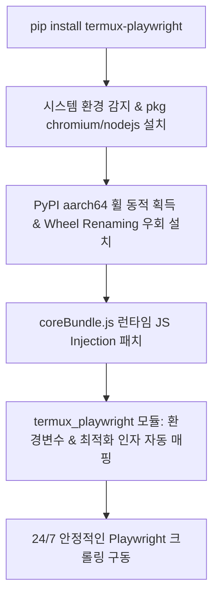

# Termux-Playwright Automated Integration (S7 Edge Crawler)

## 1. 개요 (Overview)
본 프로젝트는 자원이 제한적인 안드로이드 디바이스(Samsung Galaxy S7 등)의 가상 리눅스 환경(Termux)에서 최신 동적 웹 스크래핑 프레임워크인 **Playwright**를 안정적으로 구동하기 위한 인프라 구축 및 자동화 툴킷입니다. 

일반적으로 aarch64 안드로이드 환경에서는 공식 Playwright 바이너리 비호환, Node.js 안드로이드 플랫폼 검증 차단, 안드로이드 커널의 `/dev/shm`(공유 메모리) 부족으로 인한 OOM 크래시 문제가 발생합니다. 본 프로젝트는 **우회 설치 파이프라인, 코어 엔진 런타임 패치, 메모리 최적화 래퍼**를 통해 이 모든 한계를 극복하고 24/7 무인 자동화 데이터 수집(Crawling)을 가능하게 합니다.

---

## 2. 기술 스택 (Technology Stack)
* **OS & Environment**: Android 8.0+ (Termux), Linux (aarch64)
* **Language**: Python 3.8+, Node.js (v20+)
* **Framework**: Playwright (Async & Sync API)
* **Browser**: Chromium (Termux native package)

---

## 3. 설치 및 빠른 시작 (Quick Start)

### 📦 1단계: 패키지 설치
공식 PyPI에 등록되어 있으므로, 단 한 줄의 명령어로 설치와 우회 패치가 100% 자동 진행됩니다.

```bash
pip install --upgrade termux-playwright
```

> **Note**: 위 명령어를 실행하면 시스템 패키지(`chromium`, `nodejs`) 설치부터 Playwright 코어 엔진 패치(`coreBundle.js`)까지 모두 자동으로 수행됩니다.

### 🩺 2단계: 환경 자가진단 (CLI Doctor)
설치 및 패치가 정상적으로 적용되었는지 터미널에서 즉시 검단할 수 있습니다.

```bash
termux-playwright-doctor
```

### 💻 3단계: 초간단 크롤러 작성 및 실행
더 이상 복잡한 환경변수 설정이나 지저분한 인자(Args)를 직접 작성할 필요가 없습니다. `termux_playwright`가 모든 최적화 설정을 자동으로 처리합니다.

```python
import asyncio
from playwright.async_api import async_playwright
import termux_playwright

async def main():
    async with async_playwright() as p:
        # Termux 환경 감지, Chromium 경로 탐색, 크래시 방지 인자 자동 주입
        browser = await termux_playwright.launch(p, headless=True)
        
        page = await browser.new_page()
        await page.goto("https://www.naver.com")
        print("페이지 제목:", await page.title())
        
        await browser.close()

if __name__ == "__main__":
    asyncio.run(main())
```

---

## 4. 핵심 아키텍처 및 우회 기법 (Architecture & Workarounds)



1. **의존성(Dependency) 속임수 기법 (Wheel Renaming & Temp Isolation)**
   - PyPI API에서 `manylinux_2_17_aarch64` 규격의 Playwright 휠을 동적으로 탐색합니다.
   - 단말기의 OS 종속성 검사를 우회하기 위해 격리된 임시 폴더(`tempfile`)에서 파일명을 `none-any.whl`로 변조하여 강제 설치(`--force-reinstall --no-deps`)합니다.

2. **코어 엔진 런타임 패치 (Runtime JS Injection)**
   - Playwright 내부의 Node.js 구동 엔진(`coreBundle.js`)은 안드로이드 환경(`process.platform === 'android'`)을 식별하면 즉시 실행을 중단합니다.
   - `coreBundle.js` 최상단에 `process.platform`과 `os.platform()`을 `"linux"`로 오버라이딩하는 코드를 주입하여 플랫폼 검증을 무력화합니다.

3. **안드로이드 실전 크래시 방지 최적화 (Critical Crash Prevention)**
   - **`--disable-dev-shm-usage` (필수)**: 안드로이드 커널은 `/dev/shm`(공유 메모리) 공간이 없거나 극도로 제한되어 있어 Chromium 렌더링 시 브라우저 탭이 즉시 크래시(OOM)됩니다. 이를 방지하기 위해 `/tmp` 스토리지를 사용하도록 강제합니다.
   - **`--no-sandbox`, `--disable-setuid-sandbox`**: 안드로이드 권한 통제 메커니즘과의 충돌로 인한 좀비 프로세스 생성을 차단합니다.
   - **`--disable-gpu`, `--disable-software-rasterizer`**: 불필요한 그래픽 파이프라인 에러를 차단합니다.
   - **`--no-zygote`**: Termux 상에서의 불필요한 프로세스 포크를 방지합니다.

---

## 5. 제공되는 CLI 유틸리티

| 명령어 | 설명 |
| :--- | :--- |
| `termux-playwright-doctor` | Termux 환경, Node.js/Chromium 경로, Playwright 설치 여부 및 coreBundle.js 패치 상태를 한눈에 진단 |
| `termux-playwright-patch` | Playwright 재설치/업데이트 후 coreBundle.js 안드로이드 우회 패치만 단독 재실행 |
| `termux-playwright-install` | 시스템 의존성 설치 및 휠 우회 설치 파이프라인 전체 수동 실행 |

---

## 6. 트러블슈팅 및 롤백 히스토리 (History of Failures)

* **[실패 1] 순정 `pip install playwright` 시도**
  - **현상**: 컴파일 에러 및 브라우저 바이너리 다운로드 실패.
  - **원인**: Playwright가 지원하는 aarch64 빌드는 Bionic libc와 호환되지 않음.
  - **해결**: Termux 네이티브 `pkg install chromium` 경로를 동적 탐색하여 바인딩.

* **[실패 2] Node.js 실행 거부 (`Unsupported platform: android`)**
  - **현상**: Python 스크립트 실행 시 `Error: Unsupported platform: android` 크래시.
  - **해결**: `coreBundle.js` 최상단에 플랫폼 오버라이딩 JS 주입 패치 적용.

* **[실패 3] 브라우저 Launch 시 Zombie Process 및 OOM 크래시**
  - **현상**: 브라우저는 실행되나 페이지 이동 중 타임아웃 또는 즉시 종료(Crash)됨.
  - **원인**: 안드로이드의 샌드박스 권한 제약 및 `/dev/shm` 공유 메모리 결핍.
  - **해결**: `--disable-dev-shm-usage` 및 `--no-sandbox` 플래그를 기본 런처에 필수 내장.

---

## 7. 실물 기기 통합 테스트 (E2E Device Testing)

Termux 터미널에서 아래 명령어를 순차적으로 실행하여 검증할 수 있습니다:

```bash
# 1. 패키지 설치
pip install --upgrade termux-playwright

# 2. 설치 및 패치 진단
termux-playwright-doctor

# 3. 데모 스크립트 실행
wget https://raw.githubusercontent.com/uno-km/termux-playwright-demo/main/termux_crawler_demo.py
python termux_crawler_demo.py
```
