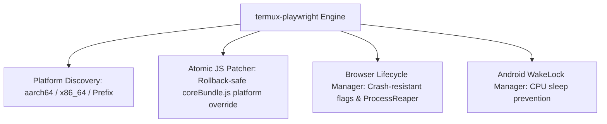

# Termux-Playwright: Architecture & Integration Engine

[](https://pypi.org/project/termux-playwright/)
[](LICENSE)

A hardened, architecture-aware runtime optimizer and automated deployment toolkit enabling **Playwright (Chromium)** execution inside Android's **Termux (Linux/aarch64/x86_64)** environments.

---

## 1. The Core Engineering Challenge

Running modern browser automation frameworks like Playwright on Android Termux encounters five fundamental architectural barriers:

1. **Bionic libc vs. Glibc Incompatibility**: Standard Playwright PyPI wheels target `manylinux` (glibc), whereas Android uses the Bionic C library.
2. **Platform Rejection in Node.js Driver**: Playwright's core Node.js driver (`coreBundle.js`) actively inspects `process.platform` and halts execution if identified as `"android"`.
3. **Absence of Shared Memory (`/dev/shm`)**: Android restricts or eliminates `/dev/shm`, causing Chromium IPC rendering channels to instantly trigger Out-Of-Memory (OOM) fatal crashes.
4. **Android Kernel Sandbox Policy Violations**: Standard Chromium sandboxing triggers permission faults under Android SELinux and unprivileged Termux namespaces.
5. **Lack of Init System / Orphaned Processes**: Android lacks an active init daemon to reap child processes, leading to zombie Chromium instances.

---

## 2. Hardened Architecture & Design Principles



- **Atomic JS AST/Byte Patching**: Modifies `coreBundle.js` via temporary shadow files and atomic `os.replace` operations, with automatic `.bak` snapshot generation and programmatic rollback (`rollback_core_bundle_patch()`).
- **Dynamic Multi-Architecture Resolution**: Automatically queries PyPI JSON API and maps host CPU architecture (`platform.machine()` -> `aarch64`, `x86_64`, `armv7l`) to the appropriate wheels without static URL lock-in.
- **Strict Error Propagation**: Eliminates error suppression (`check=False`, bare `except: pass`). All faults propagate as typed `TermuxPlaywrightError` hierarchies.
- **Zero Global Side-Effects on Import**: Importing `termux_playwright` does not mutate `os.environ` or spawn background tasks. Configuration is explicitly managed.
- **Deterministic Process Lifecycle (`ProcessReaper`)**: Tracks spawned child PIDs and registers `SIGINT`/`SIGTERM`/`atexit` hooks to eliminate orphaned Chromium processes.

---

## 3. Installation & Quick Start

### 📦 1. Installation
Install the package from PyPI:
```bash
pip install --upgrade termux-playwright
```

Execute the deterministic installation pipeline:
```bash
termux-playwright-install
```

### 🩺 2. Environment Verification (Doctor CLI)
Verify system package integrity, binary presence, and patch state:
```bash
termux-playwright-doctor
```

---

## 4. Python API Usage

```python
import asyncio
from playwright.async_api import async_playwright
import termux_playwright

async def main():
    # 1. Manage Android CPU WakeLock to prevent sleep when screen turns off
    with termux_playwright.TermuxWakeLock():
        async with async_playwright() as p:
            # 2. Launch Chromium with hardened Android arguments
            browser = await termux_playwright.launch(p, headless=True)
            
            page = await browser.new_page()
            await page.goto("https://www.example.com")
            print("Title:", await page.title())
            
            await browser.close()

if __name__ == "__main__":
    asyncio.run(main())
```

---

## 5. CLI Utilities Reference

| Command | Function |
| :--- | :--- |
| `termux-playwright-install` | Executes full dependency resolution, wheel extraction, and atomic patching. |
| `termux-playwright-doctor` | Performs typed diagnostics of Node.js, Chromium, and patch validation. |
| `termux-playwright-patch` | Standalone atomic patcher for `coreBundle.js`. |
| `termux-playwright-reap` | Scans for and forcefully terminates orphaned Chromium background processes. |

---

## 6. Testing

The test suite runs with `pytest` and verifies platform mapping, atomic patch transactions, rollback reliability, and argument construction:

```bash
pytest -v
```
