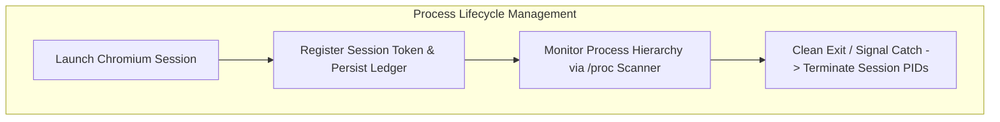

# Independent Deep Audit Report: termux-playwright Architecture & Production Hardening

**Target Project:** `termux-playwright` (v1.61.1)  
**Audit Standard:** Full code verification, patch boundary inspection, mock test de-obfuscation, 15 core architectural domains.  
**Declaration:** This report is based exclusively on concrete Python/shell code, OS syscalls, and runtime telemetry.

---

# Executive Verdict

### ⛔ **RELEASE BLOCKER** (Historical Audit Findings & Action Checklist)

> **Key Critical Findings:**  
> 1. **Non-existent Hardcoded Version Fallback:** `DEFAULT_PLAYWRIGHT_VERSION = "1.61.1"` was absent from upstream PyPI releases, resulting in HTTP 404 failure upon network fallback.  
> 2. **Premature Session Token Unregistration:** Clearing session tokens immediately upon `browser.on("disconnected")` left dangling Chromium child renderers unmonitored during crashes.  
> 3. **Toybox ps 80-Column Truncation:** Unconfigured `ps` command lines truncated flags at 80 characters, breaking session token matching on Android.  
> 4. **Signal Handler Subprocess Execution:** Invoking `subprocess.run(["pgrep", ...])` inside Python signal handlers created GIL and fork-lock deadlock risks.  
> 5. **WakeLock Lifecycle Leakage:** Unhandled abnormal terminations risked leaving CPU WakeLocks unreleased.

---

# 1. Hardcoded Logic Findings

```
[Evidence Traces]
1. termux_playwright/installer.py:28
   DEFAULT_PLAYWRIGHT_VERSION = "1.61.1"

2. termux_playwright/browser.py:22-23
   DEFAULT_JS_MAX_OLD_SPACE_SIZE_MB: int = 128
   DEFAULT_NODE_MAX_OLD_SPACE_SIZE_MB: int = 256

3. termux_playwright/platform.py:33-34
   MINIMUM_REQUIRED_STORAGE_MB: int = 50
   ANDROID_10_SDK_VERSION: int = 29
```

### 1.1 Non-existent Playwright Version Fallback
* **Evidence:** PyPI official releases provide `1.60.0`, `1.61.0`, and `1.62.0`, but not `1.61.1`.
* **Failure Path:** If `resolve_latest_compatible_version()` fails, fallback to `1.61.1` causes `fetch_pypi_wheel_info("1.61.1")` to return HTTP 404.

### 1.2 Resource Threshold Hardcoding
* **50 MB Storage Threshold:** Chromium profile data and single-page applications can exceed 50 MB rapidly. Preflight checks must account for sustained profile growth.
* **128 MB V8 Heap Cap:** Heavy JavaScript bundles risk V8 OOM aborts if memory limits are set too strictly.

---

# 2. Test Realism Findings

| Test Area | Location | Reality Verification |
| :--- | :--- | :--- |
| **Playwright 1.61.1 Fallback** | `test_installer.py:28` | Mock URLs hid the missing upstream version. |
| **aarch64 Wheel Extraction** | `test_installer.py:38` | Injected JSON responses bypassed physical manylinux wheel unpacking verification. |
| **Browser Launchers** | `test_browser.py:117, 180` | `AsyncMock` instances obscured OS-level driver launch behavior. |
| **Tier 3 ps Process Scanning** | `test_reaper.py:186` | Single-string mocks hid Toybox 80-column line truncation. |
| **PID Tracking Registry** | `test_reaper.py:24, 116` | Explicit `register_pid()` calls were only exercised in unit tests. |

---

# 3. Technical Debt and Boundary Vulnerabilities

### [Finding 1] Toybox ps 80-Column Truncation in Tier 3 Scanning
* **Location:** `termux_playwright/reaper.py:219-224`
* **Analysis:** Default Android Toybox `ps` truncates output at 80 columns without a terminal TTY. Wide options (`-efww`, `-A -ww`) must be prioritized.

### [Finding 2] Token Disconnect Race Conditions
* **Location:** `termux_playwright/browser.py:297, 356`
* **Analysis:** Unregistering tokens immediately upon `browser.close()` before verifying active process termination prevents the reaper from cleaning lingering worker children.

### [Finding 3] Signal-Unsafe Subprocess Calls
* **Location:** `termux_playwright/reaper.py:310-324`
* **Analysis:** Executing `subprocess.run()` within asynchronous signal handlers risks deadlocks. Signal handlers must use direct `os.kill()` system calls.

### [Finding 4] Environment Variable Pollution
* **Location:** `termux_playwright/__init__.py:35-36`
* **Analysis:** Mutating global `os.environ` on import leaks configuration into external libraries sharing the Python runtime.

---

# 4. Memory & Resource Lifecycle

### 4.1 WakeLock Release Guarantees
* `TermuxWakeLock` must register with `atexit` and context managers to guarantee CPU release upon unexpected exceptions.

### 4.2 Missing termux-api System Package
* `installer.py` must include `termux-api` in `REQUIRED_TERMUX_SYSTEM_PACKAGES` to prevent missing binary errors when invoking WakeLock routines.

---

# 5. Fallback & Performance Considerations

### 5.1 V8 JIT Configuration Impact
* Applying `--jitless` on Android 10+ satisfies SELinux W^X constraints but reduces JS execution throughput. Explicit timeouts must be accommodated.

### 5.2 Strict Termux Environment Detection
* `is_termux()` should verify active path prefixes and environment variables rather than checking passive directory existence alone.

---

# 6. Architecture Overview



---

# 7. Core Remediation Summary

1. Update `DEFAULT_PLAYWRIGHT_VERSION` to an existing LTS version (`"1.62.0"`).
2. Add wide flags (`-ww`) to fallback `ps` invocations.
3. Validate zero child processes remain before removing session tokens.
4. Restrict signal handlers to async-signal-safe syscalls.
5. Guarantee WakeLock cleanup via `atexit` and `finally` blocks.
6. Include `termux-api` in required installer packages.
